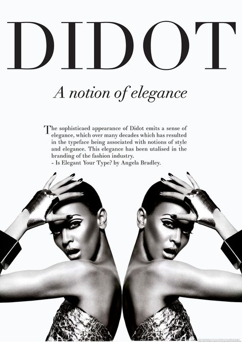

Typography is an essential feature to magazines and books, it is what captures the attention of an audience, identifies the genre and represents the certain demographic in which the type of media is attempting to select. 

>  *"the art in of arranging type to make written language appealing when displayed; the parts of arrangement include the font type, sizing of text, line spacing and letter spacing",* 

Typography is a key aspect in the creation of different types of media, making them differentiate from one another. Looking more in depth, the display of typography is put together by the weight, contrasts, width and height of the fonts which give brands their different portrayals.

The use of typography has a major influence on the success and recognition a form of media gets. Looking at *'Vogue'*, the fashion magazine has created a sense of sophistication and professionalism due to its three main font types used throughout their magazines; for the masthead, sub headings and the article titles. 

### ***Vogue's Masthead***

When analysing the title of the Vogue front cover the typography used is consistent throughout the magazines; which enables the brand to become recognisable and be familiar to the audiences. The modernised serif font *'didot'*  which was developed in the 1700s, is used as the typeface on the cover of the monthly magazines, originated from a famous French printing, it links to the definition of the word Vogue: 'style' in French. The connection between the French font choice being used on the actual branding of the French name symbolises its sophistication as the serif font is demonstrated to have an overall classy tone of the media type. Having a consistent use of the bold font on all magazines highlights to the audience that it is the title and draws their attention in first. Each magazine has a different colour dependent on the cover image of the certain edition used as the title, however the bold outline of the font is used throughout which emphasises the unique recognition the brand is conveying to its' audience. The high contrast of the 'didot' typeface 'Vogue' illustrates a fragile and stylish tone which is what the fashion magazine attempts to conveys throughout their pages.

### ***Subheadings/Cover lines***

A neutral, serif font used for the cover lines of the magazine makes the cover look well put together as the same professional branding message is suggested throughout the page. However, a lot of the editions vary in sans-serif subheadings too; both show a variety of regular and heavy weight type characteristics, the main points being bolder to grab the reader's attention. In contrast to the main title font, the subheadings are not in bold and portrayed more subtly by proving to be natural colours and of a lighter weight. conveying a more gentle and professional representation. The comparison of the harsh bold font of the masthead against the more neutral tones of the cover lines allows the reader to understand the importance of order in what to read on the cover. One would argue that the pastier colour tones of the subheading fonts dictate a more feminine representation, which determines the gender of the targeted audience. 

### ***Article Titles***

Within the magazine the titles of the articles are a coloured sans serif font, this more easily-read font enables the reader to differentiate the heading of the content inside, as its easily on the eye. The bulk of the text inside the magazine is heavily a modern serif font, giving a classier and more traditional tone throughout, therefore the importance of using a sans serif typeface as the title of the content, breaks up the text it also emphasises the modern aspect as sans serif is proven to be more modern as serif typefaces can be seen more traditionally.