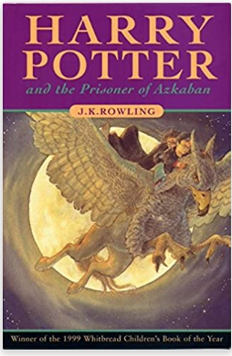
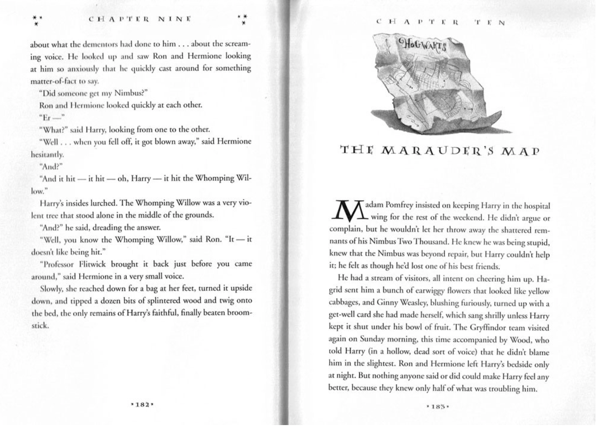

The Harry Potter book franchise has major recognition in regards to the typography choice on the front covers. As previously discussed, it has been demonstrated that typography is essential to the branding of print media. 

Looking at the phenomenon of the Harry Potter book sequal, a unique font is used to differentiate their trademark from other brandings; especially on the book covers. However, as the novels are so popular multiple covers have been released; all proving to convey different typefaces chosen for the title on the front page. 

> "Since the release of Harry Potter and the Philosopher's Stone in 1997, the seven books have been published around the world with more than 200 different cover." *\- Harry Potter fanzone*

## The different typefaces of the covers

### ***Harry P:***

This font with the lighting bolt incoperation was first illustrated by American illustrator Mary GrandPré, she used this font for the U.S editions of the Harry Potter book series. The font is the most recognisable typeface used across the Harry Potter franchise and is a popular symbol which connotes to the film and books. The use of the ligthing bolt and the ridged flicks within the text, conveys the story of the novel itself; with the wand connotations of the wizarding school. The *heavy weight* title allows it to be bold and to stand out to the readers, emphasised by its *low contrast* making it highlight a more strong and rebust storyline comapared to a high contrast where one would interpret a more gentle and fragile tone. Alongside these type charcateristics, the title also shows to be a *condensed width*; demonstrating a more pleasing to the eye and well put together cover. The font gives more an American feel about it as it is also used within Orlando Harry Potter theme parks and the American merchandise.

### *Times New Roman:*

On the U.K bloomsbury editions of the novels, the font 'Times New Roman' is used with slight alterations. The font can be seen as a traditonal, classic serif font english font, which connotes sophistication and long-establishment e.g Hogwarts. The serif typeface is more regularly seen within books as computers make it harder to show the resolution of these fonts, the regular-heavy weight of the font enables the title to stand out to the reader and captures our attention. The use of low contrast further helps the bold aspect of the title as a high contrast would be perceived as more delicate and fragile, this bold title also helps indictae the storyline and the genre of a heroic and male led adventure, featuring the main character as a male. It can be quite hard to classify the width characteristic of the text as it is extended however also regular in some aspects, however the enlarged width allows the title to be seen across the page showing the name of the book (and the character) to have importance and its the first thing aimed to be seen on the cover. Making an alteration on the classic Times New Roman font creates a branding of the franchise as its unique and doesn't use the regular fonts. 

### *Lumos:*

This typeface is inspired by chapter titles within the books - moreso in the U.S editions, the actual typeface is used as symbols of broomsticks and the snitch in quidditch games. It differs significantly from the title on the book covers, as the *weight is regular* and more of a *high contrast*. The most recognisable analysis of the type characteristics is the e*xtended width* of the text, this gives it a magical feel. The serif aspect conveys the sense of professionalism which firther demonstrates the school setting aspect of the novels, as its wizardry taught; the serif typeface also suggests a sense of traditionalism, linking to the context of the film of 'Hogwarts' being a educational place for hundreds of wizards since A.D 

