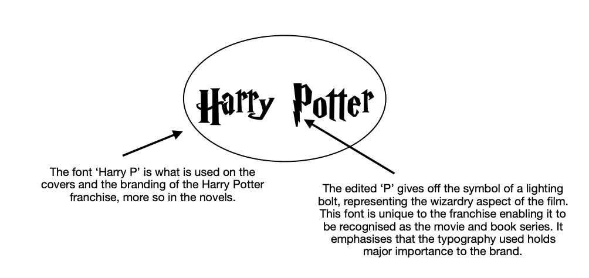

The Harry Potter book franchise As previously discussed, it has been demonstrated that typography is essential to the branding of print media. Looking at the phenomenon of the Harry Potter book sequal, a unique font is used to differentiate their trademark from other brandings; especially on the book covers. However, as the novels are so popular multiple covers have been released; all proving to convey different typefaces chosen for the title on the front page. 

> "Since the release of Harry Potter and the Philosopher's Stone in 1997, the seven books have been published around the world with more than 200 different cover." *\- Harry Potter fanzone*

## The different typefaces for the covers:

The 'Harry P' font with the lighting bolt incoperation was first illustarted by American illustrator Mary GrandPré, she used this font for the U.S editions of the Harry Potter book series

