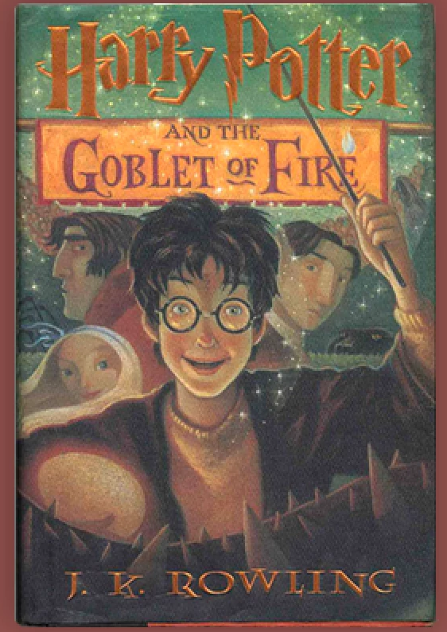

The Harry Potter book franchise has major recognition in regards to the typography choice on the front covers. As previously discussed, it has been demonstrated that typography is essential to the branding of print media. Looking at the phenomenon of the Harry Potter book sequal, a unique font is used to differentiate their trademark from other brandings; especially on the book covers. However, as the novels are so popular multiple covers have been released; all proving to convey different typefaces chosen for the title on the front page. 

> "Since the release of Harry Potter and the Philosopher's Stone in 1997, the seven books have been published around the world with more than 200 different cover." *\- Harry Potter fanzone*

## The different typefaces for the covers

### ***Harry P:***

This font with the lighting bolt incoperation was first illustrated by American illustrator Mary GrandPré, she used this font for the U.S editions of the Harry Potter book series. The font is the most recognisable typeface used across the Harry Potter franchise and is a popular symbol which connotes to the film and books. The use of the ligthing bolt and the ridged flicks within the text, conveys the story of the novel itself; with the wand connotations of the wizarding school. The *heavy weight* title allows it to be bold and to stand out to the readers, emphasised by its *low contrast* making it highlight a more strong and rebust storyline comapared to a high contrast where one would interpret a more gentle and fragile tone. Alongside these type charcateristics, the title also shows to be a *condensed width*; demonstrating a more pleasing to the eye and well put together cover.

