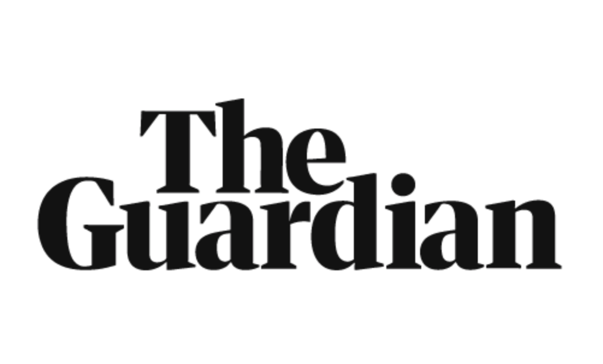
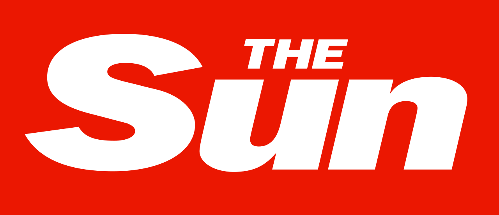

Newspaper typography is a vital factor when portraying the correct ideology and representation that newspapers wants to demonstrate for their demographic audiences. The typefaces chosen creates the brand of the newspaper as it targets audiences, ideas and beliefs. 

Looking at two newspapers which are on opposite ends of the spectrum; *The Guardian* and *The Sun*, it becomes evident that typography plays a powerful role in the construction of print media and it is what is recognised by millions for their individual reputation. 

### *The Guardian:*

The Guardian newspaper title is the font 'guardian egyptian' which is a type face of a slab-serif, it was designed by Christian Schwartz and Paul Barnes in 2004. The masthead of the broadsheet connotes sophistication due to the serif typeface as it shows traditional and old-fashioned aspects, linking to the target audience of A,B,C1 older readers moreso 35+. The type characteristics prove to be a heavy weight, which conveys strong opinionated newspaper as its bold, highlighting confidence. This portrayal is further emphasised by the low contrast, opposing a fragile representation, it is demonstrating the ideas and ideologies within the newspapers are assertive and striking. The actual print newspaper changed the typography of their masthead in 2012 where previously it was all lower cased and in blue, with a blue background. The updated version proves more sophisticated, espcially as the black is more of a formal professional colour comapred to blue. The added use of the capital letters also helps the assertive tone and makes the cover look more put together, compared to the old masthead of lower caps lettering, one could argue it doesn't show confidence in what the newspaper stands for and are attempting to portray.

### *The Sun:*

The tabloid newspaper The Sun uses 'franklin gothic heavy' font in italics for the masthead on the front cover, it is a sans-serif typeface which is suggested to be more modern and easily read. The demographic audience of the newspaper is much lower in comparison to The Guardian, as The Suns' demographic is C2,D,E with 2/3 over the age of 35. This is considerate to to the typeface as due to the lack of class the lower demographic is portrayed to have, the use of sans serif font implies a more uneducated tone as its basic and easily read. The use of the heavy weight characteristics enhances the boldness of the newspaper masthead, allowing it to stand out to their readers, this is similar to the type of weight choice used by the Guardian. The condensed width of the text, the letters being placed close together, shows a sense of unity that the newspaper is attempting to convey; alongside the low contrast, it highlights a similarity to The Guardian in a sense that both mastheads want to stand out and look dominant and powerful with bold and thick lettering.

### *The Conclusion:*

When analyisng the two different newspaper mastheads it is proven that both gage their readers by having a bold and eye catching title, using heavy weights and low constrasts allows the text to be prominent. Both newspapers target different demographics which is evident in the typography of their mastheads, The Guardian aims at a higher more upper class demographic which is evident through the serif typeface as the typography of the title; in comparison to The Sun, where their demographic is a lot lower and would be perceived as 'uneducated', they use a sans-serif font which lacks sophistication and is seen more basic.