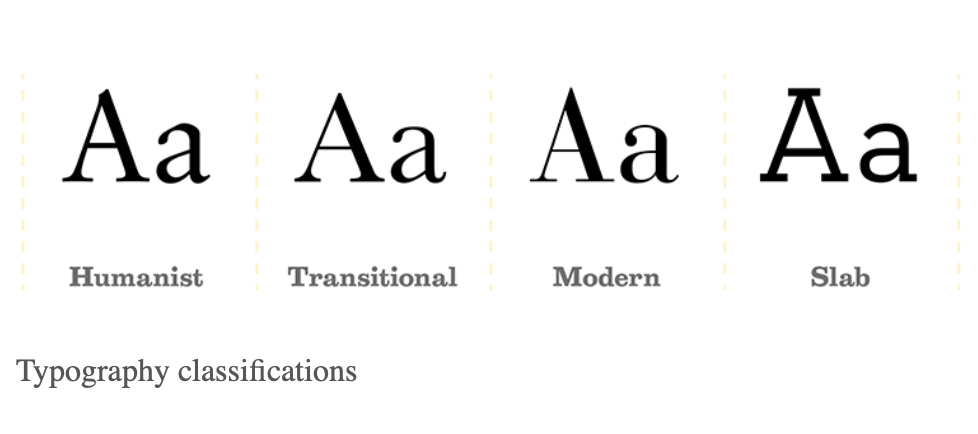
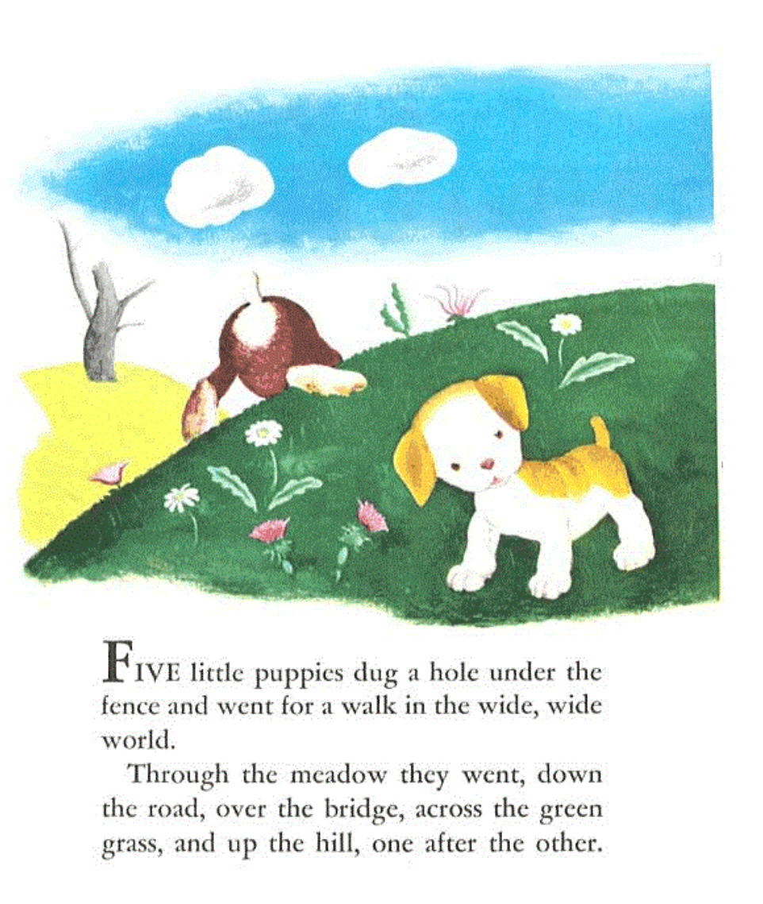
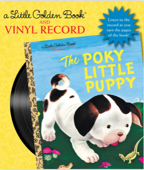
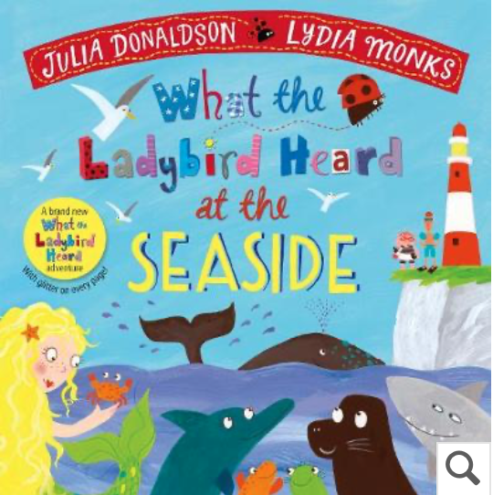

Using the correct typography on the cover of and inside children's book is one of the most important factors of its success. It is what invites the young audience to pick up the book on the bookshelf and allows them to engage with what's in the novel, especially as these books are aiding their development in terms of vocabulary, learning and being a key part of childhood.

### The History of The Typography of Children's Books

Looking at the history of typography used within children novels, typefaces used tended to be a serif font. Serif typeface fonts such as *'Humanist*' and *'Transitional'* were the most popular amongst childrens books due to their typography characteristics. The *'high x-height'* within both fonts enables the text to be easily read and highlights larger sized letters against the other serif fonts that would be used in novels. A characteristic of *'wide bracketed serifs'* are formatted witihin the two fonts, it displays as the 'curved connection' between the end points of the letter. Having wide brackets aids the children to identify the letter easier. *'Large counters'* help the text to be easily read and understood by the children; closed counters are letters with no open 'mouths' within the letter, such as 'A,B,O,Q' compared to open counters such as 'C,F,H,I,S'. Having enlarged counters helps the child read them clearly. 

**The Poky Little Puppy:** 

The novel 'The Poky Little Puppy' is an example of a childrens book published in 1942 whereby the typography follows the conventions of the style which was popular within the 1900s. The use of the *humanist* typeface within the inside text allows it to be easily read by the children as analyised above. The lack of text beneath the image also indicates that it is for younger readers as more dense, heavy text would be appealing to an older audience. 

However, the typography chosen for the cover of the novel, called the *display font*, uses the typeface '*handwriting'* all in capitals*,* this is easily read and it gives the impression that someone young has written it themselves. The contrast of the cover typeface compared to the serif typeface inside the book gives the book an appeal as it shows a more youthful tone on the cover. The modern sans-serif font enables it to be easily read and seen due to its capitalisation. 

Analyse source: <https://type-ed.com/resources/rag-right/2016/10/03/typography-childrens-books>

### The Typography of Modern Children's Books

As print media has developed over the years and the popularity of children's books have emerged, the styles of typography used for the titles and as the text inside have altered. It is very dependent on the type of children's book, for example the sans-serif typeface has become popular amongst picture books as it lacks text. These include *Helvetica, Quicksand, Lato and Avenir Next,* the typefaces are simply formatted with no flicks on the end of the letters and usually seen as more unsophisticated and used within less professional forms of print. However, that doesn't disregard the serif font within children's book as novels aged 8+ with more heavy text tend to use serif typefaces as the display font and inside, as the flicks help the readers understand the letters in big groups. 

**What the Ladybird Heard at the Seaside:**

The picture book illustrated by Lydia Monks is an efficient example of using *sans-serif* font with slight uses of the *handwriting* typeface, this again gives the illusion of one of the characters within the book has written it, or the children readers themselves. The comparison of the 1900s children's books to the more modern children's novels highlights that there has been more evoulution in terms of typography chosen, the sans-serif typeface chosen allows a more easy understanding for the children and shows less traditionalism. 

Analytical source: <https://www.indiekidsbooks.com/p/what-fonts-for-childrens-books>

From looking at the layout and typography of childrens books it is clear of the features that make them differentiate from older reader books. A large format, type size and white space with heavy illustrations connotes a more younger audience is being aimed at, compared to smaller fonts with dense text is for older readers. 

It is important to include these typography features within children novels as a child will know what takes their liking from the minute they pick the book up.