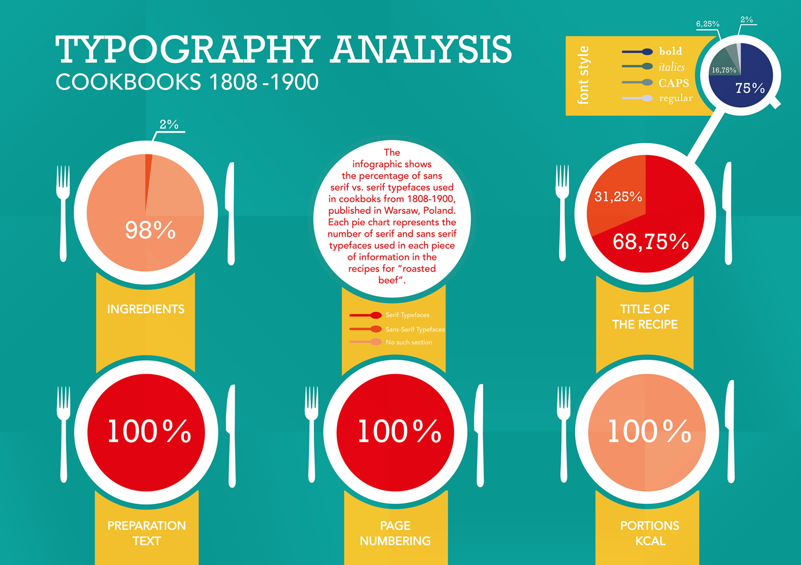
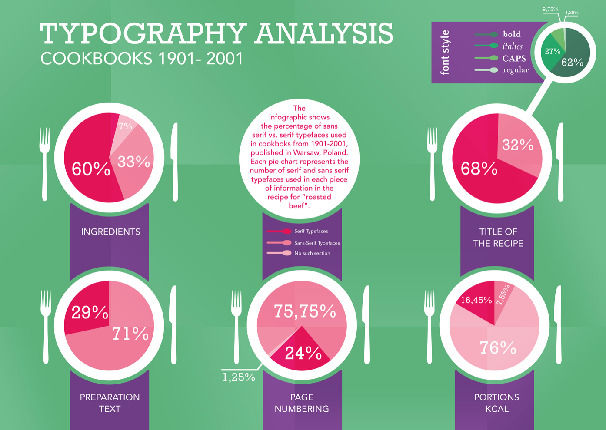

Cook books have a distinctive typography choice throughout all books published - serif typefaces. Titles of books consist of Georgia, Adobe Garamond Pro, Minion Pro, Palatino, Baskerville, and Goudy Old Style typefaces; these tend to be easier to read in printed books. 

## Cookbook Titles

On the covers of cook book recipe books, traditional typefaces which are used within the body are enlarged and bolded to be used as the masthead, this allows the book to have a consitent font theme throughout. The titles of cookbooks tend to be all capitalised or not at all; capitalised mastheads are used to attract readers whereas small text titles are more simplistic and suggest a more straightforward recipe book. 

## Typography Analysis 1808-1900

From the data presented above, the infographic highlights that between the years of 1808-1900 serif fonts are most popular in terms of typography choices regarding titles of recipes and the text within the book. With the addition of bold style, it demonstrates that the traditional and bold typefaces were popular within the time period. 

#### *Title of the recipe:*

## Typography Analysis 1901-2001

Source analysis: <https://www.behance.net/gallery/10862893/Master-thesis-cookbooks-analysis>

Source analysis: <http://www.selfpublishacookbook.com/info/how-to-design-cookbook/more/what-fonts-to-use-in-your-cookbook>