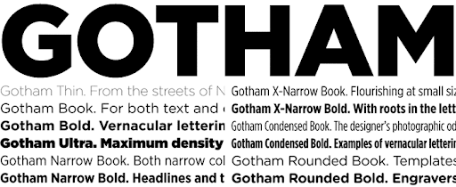

GQ magazine is an 'American internatioanl monthly men's magazine based in New York City.' Founded in 1931, the modern magazine focuses on the publication of topics:

* Fashion
* Style and Culture for men
* Food
* Movies
* Fitness
* Sex
* Sports

## Masthead Choices

On the front cover of the GQ magazines, the masthead is the typeface *'Gotham.'* This is a sans-serif font which was designed by American Type Designer Tobias Frere-Jones, and released in 2000. The inspiration of the creation for the font came from examples of architectural signs of the mid 1900s. 

