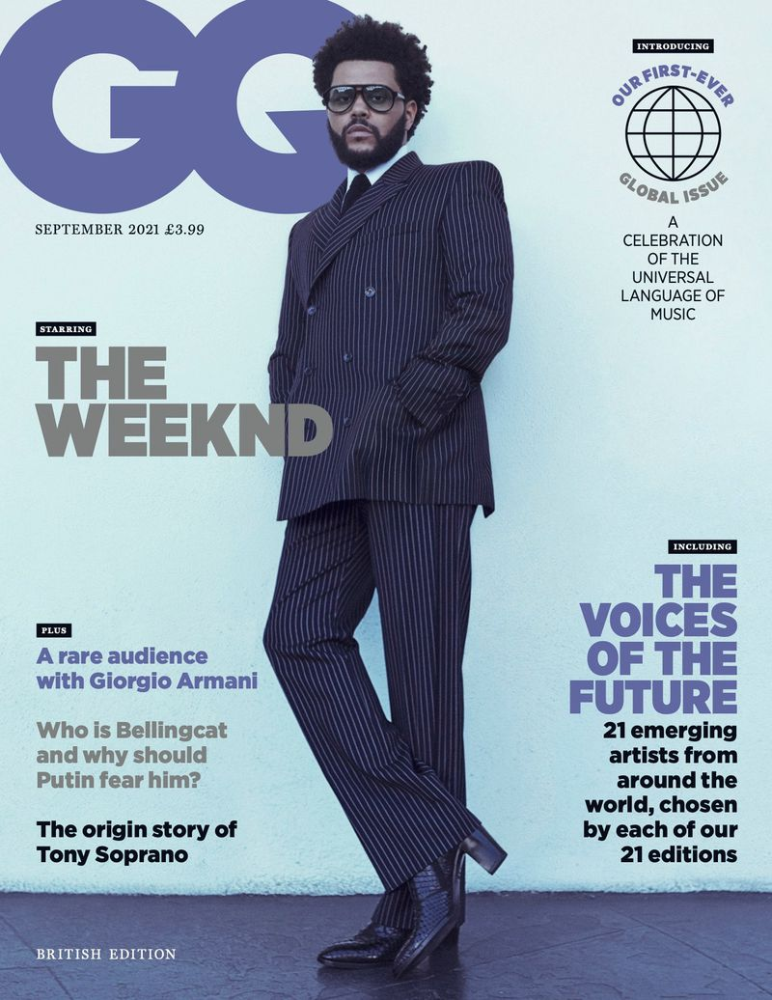

GQ magazine is an 'American international monthly men's magazine based in New York City' with a print readership of 10.7 million per month. Founded in 1931, the first men's magazine is aimed at young males aged 18-25 of a higher demographic audience. The modern magazine shows sophistication but youthfulness through the use of typography choices made and focuses on the publication of topics:

* Fashion
* Style and Culture for men
* Food
* Movies
* Fitness
* Sex
* Sports

## Masthead Choices

On the front cover of the GQ magazines, the masthead is the typeface *'Gotham.'* This is a sans-serif font which was designed by American Type Designer Tobias Frere-Jones, and released in 2000. The inspiration of the creation for the font came from examples of architectural signs of the mid 1900s. The title is of a '*heavy weight'* which proves the bold aspect to stand out, connoting a bold statement from the magazine. Its *'regular width'*  is shown by the overlap of the two letters, with a *'low contrast'* aiding its' boldness and attempt to stand out to consumers. The capitalisation used is to emphasis that '*bold statement'* which is styled through the *'heavy weight'.* 

The masthead typeface choice indicates a modern and sleek look. The use of a sans-serif font being used as the title of the magazine cover suggests the piece of print media is aimed at a more younger audience. The font is seen as a more contemporary, sleek font compared to serif which shows more traditional and professional qualities. 

## Cover Lines

The typography of the GQ magazine cover lines differ between sans-serif and serif font with the array of *heavy weight* styles and bolded words. 

#### *April 2021 Edition - serif and sans-serif cover line fonts:*

The Tom Holland edition of the GQ magazine proves to have a variety of mixed serif and sans-serif fonts for the cover lines; using this technique makes it more appealing to the reader as it breaks up a consistent font used. In the example above it is evident that more of the professional and important topics being hinted at inside have the serif fonts, which shows that those typefaces are more sophisticated. The serif fonts are also highlighted with an italic style demonstrating more important information. Serif font cover lines at the bottom of the page convey text with a *'light weight'* and '*high constrast'* showing a more delicate stance, compared to sans-serif typefaces where it is not perceived as dainty and gentle, it is more bulky and bold to catch the readers attention. 

#### *September 2021 Edition - Serif cover line fonts:*

The more recent edition of the GQ magazine shows all cover lines being of sans-serif typefaces which fit the theme with the consistent use of all the cover lines being the same. However, this edition above shows the majority of the cover line text to be of a *'heavy weight'* which depicts the boldness and grabs the attention of the readers by teasing what is inside. The '*condensed'* style of the main title cover lines make the cover look tightly compact.