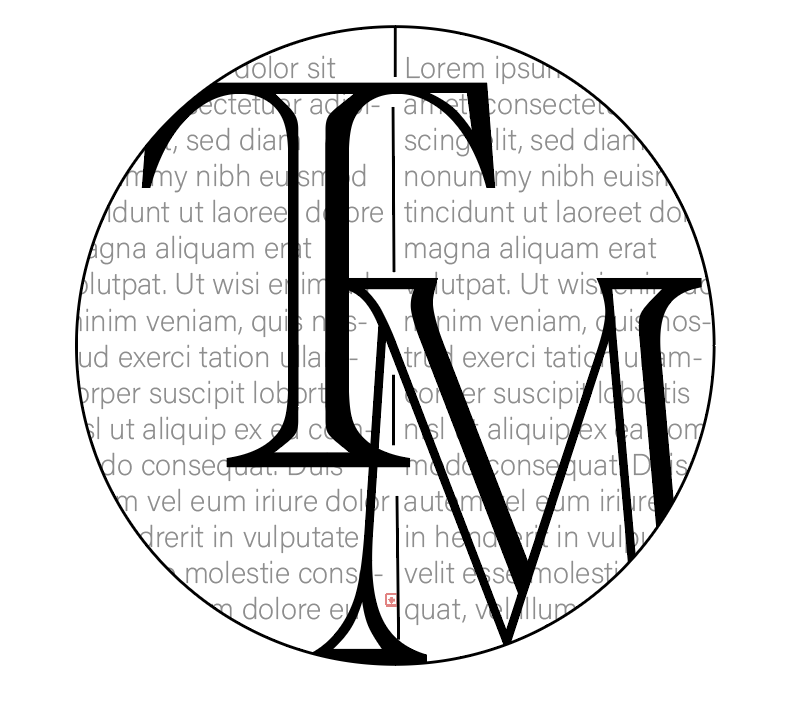

## What have I conducted in this blog?

The main ideas of this blog is analysing typography in different forms of print media. Looking at the reasonings and the importance of the choices print media forms make and how much of an effect the typography has in terms of reputations, branding and recognition. 

It is fascinating finding the research and analysing the different forms of print media and their choices of typography picked in terms of creating a brand and targetting their audiences. 

##### *Forms of print media analysis there is in the blog:*

* Magazines
* Newspapers
* Books

Comparing different brands in terms of the typefaces they use within this blog also gives an understanding of the different typography choices and what they connote. Many would say the serif typeface conducts more of a sophisticated tone in opposition to a sans-serif font which is more basic, however does show a modern interpretation.

## Why have I used the banner image and my created logo?

***The Logo***

I designed my logo so it gave the understanding of the general idea of the blog: print media typography. I placed 'TM' meaning type media on top of a book page layout, I used placeholder text behind the main capitals with a line down the middle to give the sense of a novel; as a form of print media. I went for a traditional black and white colour scheme as print is formally linked to more old-school and black and white. I used a serif font for the abbreviated *'Typemedia'* as its a more traditional and can link to the black and white era asmost fonts hadn't been devloped by then, also books are predominantly in serif font and as a form of print media, I felt it linked efficiently.

From this logo I also created a favicon using [https://favicon.io ](https://favicon.io)of a simple 'T' connoting to *typography,* I styled it in a black coloured *Note Serif Display* typeface which was a simailr style to the logo used, as well as the alike colour scheme.

***The Banner:***

I chose this banner image from [https://unsplash.com ](https://unsplash.com)as it visually shows the readers examples of the forms of print media and the array of typography titles that are used. The array of magazine front covers highlights the typography choices are used for different branding and genres of print media forms.

## Why I chose the name of my website?

***TypeMedia:***

I chose to title my site 'TypeMedia' because it abbreviates ot the typography of media, I didn't include print within the name as the book background within the logo symbolise this. Another reasoning to why I chose it, was because in print media, text tends to be *'typed'* rather than other forms of media; I thought the play-on words were rather figurative.